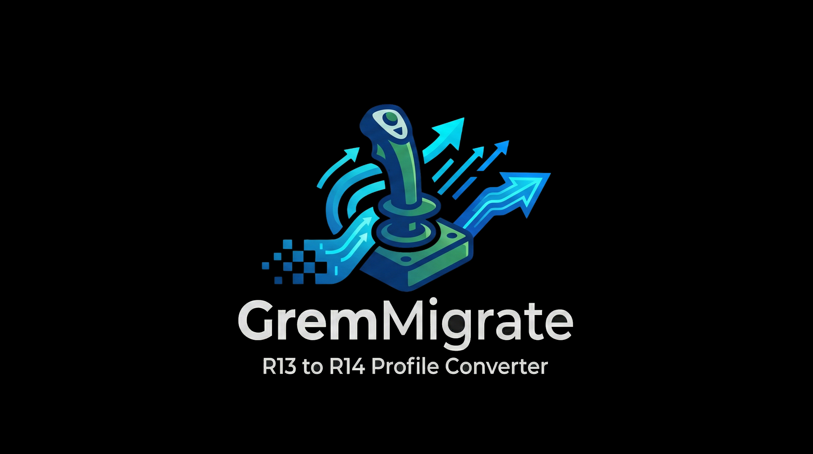

<p align="center">
  
</p>

<p align="center">
  <strong>Joystick Gremlin R13 → R14 Profile Converter</strong>
</p>

<p align="center">
  Free, fast, and fully client-side. No upload, no server — your profile never leaves your browser.
</p>

<p align="center">
  <a href="https://drrakendu78.github.io/GremMigrate/"><strong>🌐 Open GremMigrate</strong></a>
</p>

<p align="center">
  <a href="https://drrakendu78.github.io/GremMigrate/"></a>
  <a href="https://github.com/drrakendu78/GremMigrate/blob/master/LICENSE"></a>
  
  
  
</p>

---

## Features

- **Drag & Drop Conversion** — Drop your R13 `.xml` profile and get a R14 profile instantly.
- **Full Action Support** — Remaps, macros, response curves, mode switches, virtual buttons, map-to-mouse — all converted automatically.
- **Detailed Summary** — Devices, modes, inputs, and actions count with per-device collapsible breakdown.
- **Copy or Download** — Download the converted profile or copy the XML to clipboard.
- **Clear Warnings** — Any skipped or unsupported actions are flagged with explanations.
- **10 Languages** — Auto-detected from browser. English, Français, Deutsch, Español, Português, Italiano, 日本語, 中文, 한국어, Русский.
- **Privacy First** — Zero network requests after page load. No cookies, no analytics, no tracking.

## Supported Conversions

| R13 Action Type | R14 Support |
|:---|:---:|
| Button remap (vJoy) | ✅ |
| Axis remap (vJoy) | ✅ |
| Hat remap (vJoy) | ✅ |
| Response curve (deadzone + control points) | ✅ |
| Macro (key sequences + pauses) | ✅ |
| Temporary mode switch | ✅ |
| Cycle modes | ✅ |
| Map to mouse | ✅ |
| Virtual buttons (axis-to-button) | ✅ |
| Text-to-Speech | ⚠️ Skipped* |

> \*Text-to-Speech actions were removed in Joystick Gremlin R14 and have no equivalent. They are skipped with a warning.

## Quick Start

1. **Open** GremMigrate in your browser
2. **Drop** your Joystick Gremlin R13 profile (`.xml`) or click to browse
3. **Review** the conversion summary and any warnings
4. **Download** your R14 profile or copy the XML

## Building from Source

### Prerequisites

- [Node.js](https://nodejs.org/) 18+

### Steps

```bash
# Clone the repository
git clone https://github.com/drrakendu78/GremMigrate.git
cd GremMigrate

# Install dependencies
npm install

# Run in development
npm run dev

# Build for production
npm run generate
```

Static output in `.output/public/` — deploy to any static hosting provider.

## Tech Stack

| Component | Technology |
|:---|:---|
| Framework | [Nuxt 4](https://nuxt.com/) (Vue 3 + TypeScript) |
| Styling | [Tailwind CSS](https://tailwindcss.com/) |
| Rendering | Client-side only (`ssr: false`) |
| i18n | Custom composable (10 languages) |
| Security | CSP, nosniff, filename sanitization |

## Architecture

```
GremMigrate/
├── app/
│   ├── composables/
│   │   ├── useConverter.ts        # Orchestration, validation, file handling
│   │   ├── useR13Parser.ts        # R13 XML → typed R13 objects
│   │   ├── useR14Generator.ts     # R13 objects → R14 XML output
│   │   └── useI18n.ts             # Multi-language support (10 languages)
│   ├── components/
│   │   ├── AppFooter.vue          # Footer with credits & links
│   │   └── LangSwitcher.vue       # Language selector with flags
│   ├── types/
│   │   └── profile.ts             # TypeScript interfaces (R13, stats)
│   ├── pages/
│   │   ├── index.vue              # Main converter UI
│   │   └── privacy.vue            # Privacy policy (translated)
│   ├── assets/css/
│   │   └── main.css               # Transitions, glow effects, glass UI
│   └── app.vue                    # Root layout + background effects
├── public/                        # Logos, favicon, static assets
└── nuxt.config.ts                 # Meta tags, CSP headers
```

### Conversion Pipeline

```
R13 XML file  →  useR13Parser.ts  →  useR14Generator.ts  →  R14 XML output
                 (parse to typed       (transform to R14       (download or
                  R13 objects)          XML structure)          copy to clipboard)
```

## Security

- **File size limit** — 10 MB maximum
- **Strict XML validation** — Rejects non-XML and non-Joystick Gremlin files before parsing
- **Filename sanitization** — Blocks path traversal and special characters
- **Content Security Policy** — `default-src 'self'`, `connect-src 'none'`, `frame-ancestors 'none'`
- **X-Content-Type-Options** — `nosniff`

## Contributing

Contributions are welcome. Feel free to open an issue or submit a pull request.

## License

This project is licensed under the [MIT License](LICENSE).

---

<p align="center">
  Made with Vue and TypeScript by <a href="https://github.com/drrakendu78">Drrakendu78</a>
</p>
